# 🚀 Complete High-Availability Ceph + NFS-Ganesha Architecture & Deployment Guide

This document provides a comprehensive technical reference for the **High-Availability (HA) Ceph + NFS-Ganesha + Pacemaker/Corosync Storage Cluster** integrated with a **5-Node Kubernetes Cluster** on Google Cloud Platform (GCP).

---

## 🏗️ Unified 15-Tool ASCII Architecture Diagram

```text
==============================================================================================================
                                ☸️ KUBERNETES COMPUTE LAYER (Pods & Workloads)
==============================================================================================================
[ K8s Control Plane Nodes ]                                                [ K8s Worker Nodes ]
  • nfs-common (Linux Kernel Driver)                                         • nfs-common (Linux Kernel Driver)
  • k8s-nfs-provisioner (StorageClass)                                      • Pods (Nextcloud / Spring Apps)
         │                                                                          │
         └────────────────────────────────────┬─────────────────────────────────────┘
                                              │ (NFSv4 Write Requests to 10.140.0.5:2049)
                                              ▼
==============================================================================================================
                     ⚡ HIGH-AVAILABILITY & NFS GATEWAY LAYER (Pacemaker + Ganesha)
==============================================================================================================
                         [ ⚡ Floating Virtual IP: 10.140.0.5 (Pacemaker Managed) ]
                                              │
                 ┌────────────────────────────┴────────────────────────────┐
                 ▼                                                         ▼
    ┌─────────────────────────┐                               ┌─────────────────────────┐
    │ 🟢 Server 1 (haproxy-1) │                               │ 🟡 Server 2 (haproxy-2) │
    │    [ ACTIVE GATEWAY ]   │                               │    [ STANDBY GATEWAY ]  │
    ├─────────────────────────┤                               ├─────────────────────────┤
    │ 🌐 nfs-ganesha          │                               │ 🌐 nfs-ganesha          │
    │ 🔌 nfs-ganesha-ceph     │                               │ 🔌 nfs-ganesha-ceph     │
    │ ⚡ pacemaker & pcsd     │ <══ UDP 5404/5405 Heartbeats ═>│ ⚡ pacemaker & pcsd     │
    │ 💓 corosync             │   (Totem Token Protocol)      │ 💓 corosync             │
    │ 📜 resource-agents-extra│                               │ 📜 resource-agents-extra│
    └────────────┬────────────┘                               └────────────┬────────────┘
                 │                                                         │
=================│=========================================================│==================================
                 ▼                                                         ▼
==============================================================================================================
                         💾 DISTRIBUTED STORAGE LAYER (Ceph Quincy + BlueStore)
==============================================================================================================
┌──────────────────────────────┐ ┌──────────────────────────────┐ ┌──────────────────────────────┐
│ [ Server 1: haproxy-1 ]      │ │ [ Server 2: haproxy-2 ]      │ │ [ Server 3: haproxy-3 ]      │
├──────────────────────────────┤ ├──────────────────────────────┤ ├──────────────────────────────┤
│ ⏱️ chrony (NTP Time Sync)    │ │ ⏱️ chrony (NTP Time Sync)    │ │ ⏱️ chrony (NTP Time Sync)    │
│ 🔓 ufw (Ports 2049,6789,2224)│ │ 🔓 ufw (Ports 2049,6789,2224)│ │ 🔓 ufw (Ports 2049,6789,2224)│
│ 🛠️ curl, wget, net-tools    │ │ 🛠️ curl, wget, net-tools    │ │ 🛠️ curl, wget, net-tools    │
├──────────────────────────────┤ ├──────────────────────────────┤ ├──────────────────────────────┤
│ 🐳 docker.io Containers:     │ │ 🐳 docker.io Containers:     │ │ 🐳 docker.io Containers:     │
│   • ceph-mon (Cluster Mon)   │ │   • ceph-mon (Cluster Mon)   │ │   • ceph-mon (Cluster Mon)   │
│   • ceph-mgr (Manager)       │ │   • ceph-mgr (Manager)       │ │   • ceph-mds (Metadata)      │
│   • ceph-osd (Storage)       │ │   • ceph-osd (Storage)       │ │   • ceph-osd (Storage)       │
├──────────────────────────────┤ ├──────────────────────────────┤ ├──────────────────────────────┤
│ 🧰 cephadm & ceph-common     │ │ 🧰 cephadm & ceph-common     │ │ 🧰 cephadm & ceph-common     │
│   (libcephfs.so C Library)   │ │   (libcephfs.so C Library)   │ │   (libcephfs.so C Library)   │
├──────────────────────────────┤ ├──────────────────────────────┤ ├──────────────────────────────┤
│ 💾 lvm2 -> Disk /dev/sdb     │ │ 💾 lvm2 -> Disk /dev/sdb     │ │ 💾 lvm2 -> Disk /dev/sdb     │
│   (50GB Ceph OSD Storage)    │ │   (50GB Ceph OSD Storage)    │ │   (50GB Ceph OSD Storage)    │
└──────────────┬───────────────┘ └──────────────┬───────────────┘ └──────────────┬───────────────┘
               │                                │                               │
               └────────────────────────────────┴───────────────────────────────┘
                                                ▼
                             [ 🔒 Unified 3x Replicated CephFS Storage Pool ]
==============================================================================================================
```

---

## 🛠️ Complete 15-Tool Inventory & Layer Placements

| Category | Tool / Package Name | Layer Placement | Technical Purpose & Function |
| :--- | :--- | :--- | :--- |
| **K8s Integration** | **`nfs-common`** | K8s Master & Worker Nodes | Linux kernel drivers (`mount.nfs4`, `rpcbind`) allowing nodes to mount NFS. |
| | **`k8s-nfs-provisioner`** | K8s Control Plane | Dynamic StorageClass controller (`nfs-client`) automating PVC subdirectory creation. |
| **HA & Failover** | **`pacemaker`** | Storage Tier (`haproxy-1..3`) | Cluster resource manager governing Virtual IP (`10.140.0.5`) failover. |
| | **`corosync`** | Storage Tier (`haproxy-1..3`) | Totem single-ring messaging engine running UDP 5404/5405 heartbeat pings. |
| | **`pcs` & `pcsd`** | Storage Tier (`haproxy-1..3`) | Management CLI and daemon (Port 2224) for cluster administration. |
| | **`resource-agents-extra`**| Storage Tier (`haproxy-1..3`) | OCF script library (`IPaddr2`) executing `ip addr add` & Gratuitous ARPs. |
| **NFS Gateway** | **`nfs-ganesha`** | Gateway Tier (`haproxy-1..3`) | User-space multi-threaded NFSv4 server daemon listening on TCP 2049. |
| | **`nfs-ganesha-ceph`** | Gateway Tier (`haproxy-1..3`) | FSAL plugin bridge translating NFS calls directly to CephFS. |
| **Storage Engine** | **`cephadm`** | Storage Tier (`haproxy-1..3`) | Master Ceph orchestrator managing container daemons and cluster topology. |
| | **`ceph-common`** | Storage Tier (`haproxy-1..3`) | `ceph` CLI tool and native `libcephfs.so` user-space C libraries. |
| | **`docker.io`** | Storage Tier (`haproxy-1..3`) | Container runtime running isolated Ceph daemons (`MON`, `MGR`, `OSD`, `MDS`). |
| | **`lvm2`** | Storage Tier (`haproxy-1..3`) | Formats `/dev/sdb` disks into raw BlueStore volume groups for OSD storage. |
| **Groundwork** | **`chrony`** | Infrastructure Base | NTP time sync daemon maintaining sub-millisecond clock alignment across nodes. |
| | **`ufw`** | Infrastructure Base | Linux firewall (configured disabled by default for unblocked cluster traffic). |
| | **`curl, wget, net-tools`**| Infrastructure Base | Package fetching, key verification, and socket debugging (`netstat`, `ifconfig`). |

---

## 🔬 Individual Deep-Dive Reference & Diagrams for Every Tool

---

### 1. `corosync`
High-frequency cluster messaging engine running on UDP ports 5404 & 5405.

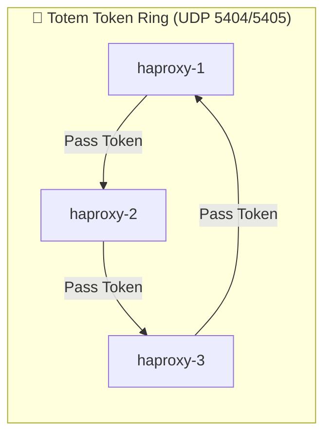

- **Deep Technical Details**:
  - Implements the **Totem Single-Ring Ordering Protocol**. A virtual token rotates sequentially between nodes on UDP ports 5404/5405.
  - **Quorum Enforcement**: Calculates mathematical quorum ($N/2 + 1$). In a 3-node cluster, at least 2 nodes must be alive to form quorum.
  - **Split-Brain Protection**: If `haproxy-1` gets partitioned from the network, `haproxy-2` and `haproxy-3` form a majority quorum (2/3), while `haproxy-1` sees only 1/3, loses quorum, and self-fences.
- **What Breaks Without It**: Nodes cannot tell if other servers are alive, leading to dual-active split-brain write collisions that permanently corrupt CephFS.

---

### 2. `pacemaker`
High-availability cluster resource manager (The Brain).

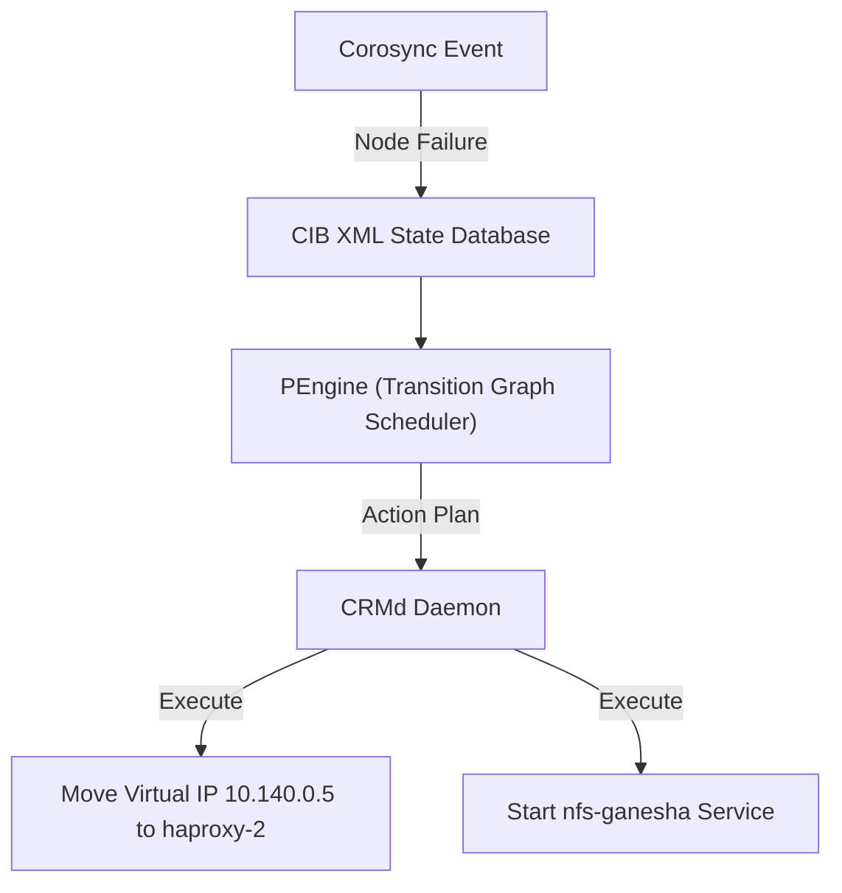

- **Deep Technical Details**:
  - **CIB State Engine**: Syncs cluster configuration XML state file (`cib.xml`) across all storage nodes.
  - **PEngine Transition Graph**: Evaluates rules and constraints when events occur:
    - **Ordering Constraint**: `nfs_vip` (Virtual IP) MUST start BEFORE `nfs-ganesha`.
    - **Colocation Constraint**: `nfs-ganesha` MUST run on the exact node holding `nfs_vip`.
  - **15-Second Active Health Checks**: Polls TCP port 2049 every 15 seconds to ensure NFS-Ganesha is responding, automatically triggering a local service restart or cross-node failover if it fails.
  - **STONITH Fencing**: Executes node fencing (reboot/power cut) if a node becomes unresponsive.
- **What Breaks Without It**: When a server crashes, no automated process exists to migrate `10.140.0.5` or start NFS services on standby nodes.

---

### 3. `resource-agents-extra` (`IPaddr2`)
Standardized OCF script library executed by Pacemaker.

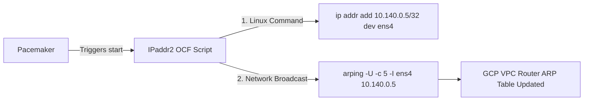

- **Deep Technical Details**:
  - **OCF Specification**: Provides standard execution hooks (`start`, `stop`, `status`, `monitor`).
  - **`IPaddr2` Execution Engine**:
    1. Executes `ip addr add 10.140.0.5/32 dev ens4` to bind the IP to the interface.
    2. Executes `arping -U -c 5 -I ens4 10.140.0.5` (Gratuitous ARP broadcast).
  - **Gratuitous ARP Broadcasting**: Informs all network switches and GCP VPC routers that `10.140.0.5` is now bound to `haproxy-2`'s MAC address.
- **What Breaks Without It**: Pacemaker attempts a failover, but the OS never physically binds `10.140.0.5` to the network interface or updates router ARP tables.

---

### 4. `nfs-ganesha`
User-space multi-threaded NFSv4 server daemon listening on TCP port 2049.

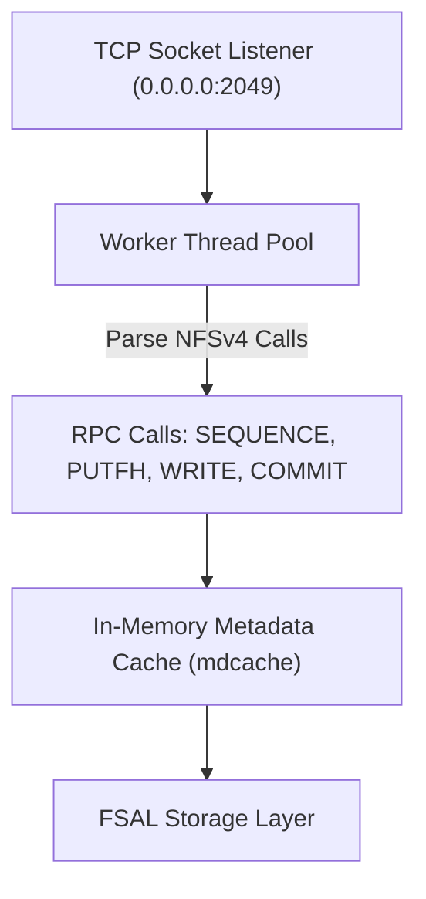

- **Deep Technical Details**:
  - **User-Space Architecture**: Runs as `/usr/bin/ganesha.nfsd`, bypassing kernel single-thread bottlenecks.
  - **Dynamic Multi-Threading**: Spawns worker thread pools to handle thousands of concurrent `ReadWriteMany` requests from Kubernetes pods.
  - **In-Memory `mdcache`**: Caches inode attributes in RAM to accelerate file metadata lookups (`LOOKUP`, `GETATTR`).
  - **NFSv4 State Lock Recovery**: Integrates with Pacemaker via DBus to allow client pods to reclaim NFSv4 file locks gracefully during failover without `ESTALE` errors.
- **What Breaks Without It**: Pods hit single-threaded kernel locks under high load and suffer `Stale File Handle` (`ESTALE`) crashes during server failovers.

---

### 5. `nfs-ganesha-ceph` (FSAL_CEPH)
FSAL plugin bridge (`libganesha_fsal_ceph.so`) translating NFS requests directly to CephFS.

```mermaid
flowchart LR
    NFSCall["NFS RPC WRITE"] --> FSAL["nfs-ganesha-ceph (FSAL_CEPH)"]
    FSAL -->|Convert NFS FH -> Ceph Inode| CAPI["libcephfs.so C API"]
    CAPI -->|ceph_ll_write()| CephOSD["Ceph OSD Storage"]
```

- **Deep Technical Details**:
  - **Direct RAM-to-Ceph Streaming**: Translates NFS RPC calls directly into `libcephfs.so` user-space C function calls (`ceph_ll_write()`, `ceph_ll_lookup()`) without touching local host disks.
  - **Ceph Inode Lock Mapping**: Maps NFS file locks directly to Ceph MDS inode locks to allow safe multi-pod file edits.
  - **POSIX Permission Mapping**: Preserves Linux user IDs (`uid`), group IDs (`gid`), and POSIX permissions across Ceph storage.
- **What Breaks Without It**: `nfs-ganesha` cannot communicate with Ceph, forcing storage to write to un-replicated local host disks.

---

### 6. `cephadm`
Official master Ceph cluster orchestrator.

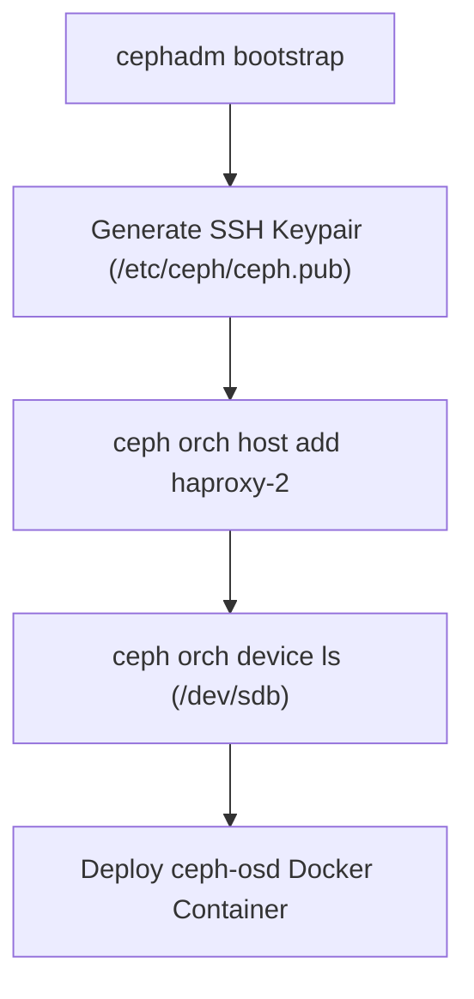

- **Deep Technical Details**:
  - **Automated Container Lifecycle**: Manages `ceph-mon`, `ceph-mgr`, `ceph-osd`, and `ceph-mds` as Docker containers (`quay.io/ceph/ceph`), restarting failed containers automatically.
  - **Automated SSH Key Propagation**: Automatically connects to nodes via SSH to install prerequisites and provision daemons.
  - **Automated OSD Creation**: Scans attached block devices (`ceph orch device ls`), formats `/dev/sdb` via `lvm2`, and provisions BlueStore OSD containers automatically.
  - **Zero-Downtime Rolling Upgrades**: Performs rolling container updates node-by-node without taking CephFS offline.
- **What Breaks Without It**: Cluster deployment requires over 150 manual, error-prone terminal commands for SSH keys, daemons, and systemd services.

---

### 7. `ceph-common`
Administrative CLI tools (`ceph`) and native user-space libraries (`libcephfs.so`).

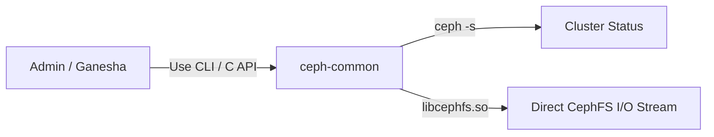

- **Deep Technical Details**:
  - **`libcephfs.so` Shared Library**: Provides low-level C functions (`ceph_ll_lookup`, `ceph_ll_read`, `ceph_ll_write`) required by `nfs-ganesha-ceph`.
  - **`ceph` CLI Management Tool**: Provides cluster management commands (`ceph status`, `ceph osd status`, `ceph fs ls`).
- **What Breaks Without It**: `nfs-ganesha-ceph` fails to load due to missing `libcephfs.so` shared libraries, and administrative health monitoring commands fail.

---

### 8. `docker.io`
Linux container runtime engine.

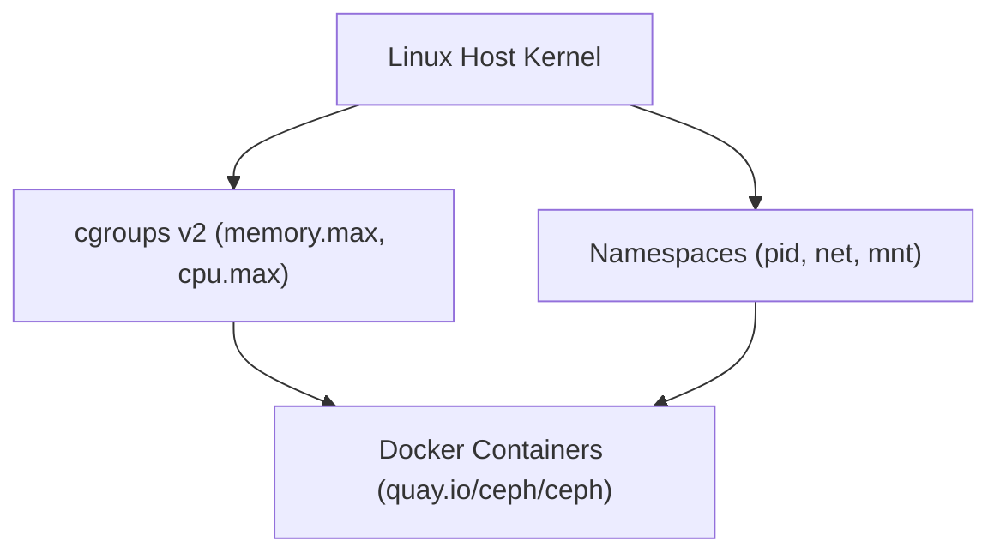

- **Deep Technical Details**:
  - **Kernel Resource Control (`cgroups v2`)**: Enforces memory and CPU resource boundaries (`memory.max`, `cpu.max`) on Ceph daemons.
  - **Namespace Isolation**: Uses `pid`, `net`, `ipc`, and `mnt` Linux namespaces to keep Ceph libraries completely separate from the host OS.
  - **Restart Policies**: Automatically restarts failed containers (`restart: always`).
- **What Breaks Without It**: Ceph daemons pollute host OS libraries, causing dependency conflicts and unmanaged process crashes.

---

### 9. `lvm2`
Logical Volume Manager.

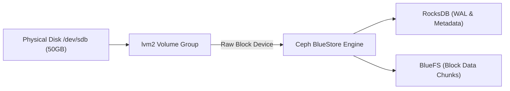

- **Deep Technical Details**:
  - **Raw Block Device Allocation**: Formats physical disk `/dev/sdb` into raw volume groups for Ceph **BlueStore**.
  - **Bypasses Local Filesystems**: Completely avoids ext4/xfs filesystems to eliminate double-journaling overhead.
  - **RocksDB & BlueFS**: BlueStore uses **RocksDB** for metadata/WAL (Write-Ahead Logging) and **BlueFS** for raw block data allocation.
- **What Breaks Without It**: Ceph OSDs cannot format raw disks, falling back to slow filesystem journaling.

---

### 10. `chrony`
NTP time synchronization daemon.

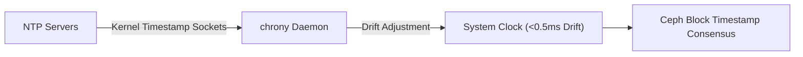

- **Deep Technical Details**:
  - **POSIX Kernel Timestamping**: Uses raw `SO_TIMESTAMPING` sockets to measure NTP network offset and jitter.
  - **Clock Skew Threshold**: Keeps node clocks within **<0.5ms**. If drift exceeds 0.05 seconds, Ceph locks metadata updates to prevent timestamp corruption.
- **What Breaks Without It**: Ceph locks metadata operations and enters `HEALTH_WARN (clock skew detected)`, blocking file writes.

---

### 11. `ufw`
Linux Uncomplicated Firewall.

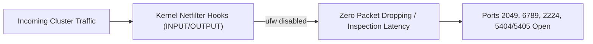

- **Deep Technical Details**:
  - **Netfilter Hook Management**: Controls Linux kernel `iptables`/`nftables` packet filtering chains (`INPUT`, `OUTPUT`, `FORWARD`).
  - **Unblocked Cluster Traffic**: Configured disabled by default so cluster communication ports operate with zero packet filtering delay.
- **What Breaks Without It**: Incorrectly configured firewall rules drop Corosync heartbeat packets (5404/5405), causing false failover loops.

---

### 12. `curl, wget, net-tools`
System prerequisites and network debugging utilities.

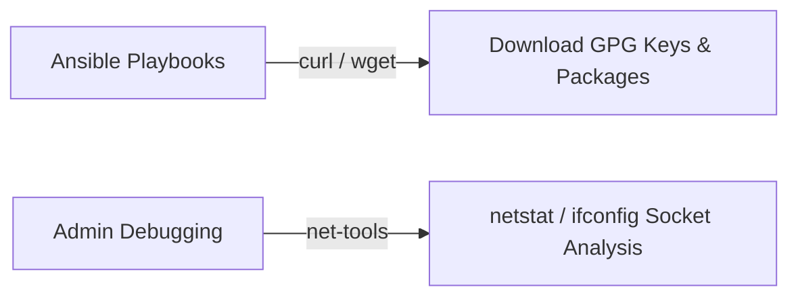

- **Deep Technical Details**:
  - **`curl` / `wget`**: Performs HTTP/HTTPS transfers for GPG signing keys and repository packages.
  - **`net-tools`**: Provides low-level socket inspection tools (`netstat -tulnp`, `ifconfig`) to verify port bindings.
- **What Breaks Without It**: Playbooks fail to fetch GPG repository keys, and network socket inspection commands fail.

---

### 13. `nfs-common`
Linux kernel NFS client utilities (`mount.nfs4`, `rpcbind`).

```mermaid
flowchart LR
    Pod["Kubernetes Pod"] -->|Mount Request| KernelNFS["nfs-common (mount.nfs4)"]
    KernelNFS -->|SunRPC Layer (rpcbind)| Socket["TCP Socket to 10.140.0.5:2049"]
```

- **Deep Technical Details**:
  - **Kernel NFS Client Drivers**: Provides Linux kernel modules (`nfs.ko`, `nfsv4.ko`) and helper utilities (`mount.nfs4`, `rpcbind`).
  - **TCP Socket Management**: Manages TCP connections to `10.140.0.5:2049` for client mount points.
- **What Breaks Without It**: Kubernetes worker nodes fail to mount NFS volumes, throwing `mount: unknown filesystem type 'nfs'`.

---

### 14. `k8s-nfs-provisioner`
Kubernetes dynamic `nfs-client` StorageClass controller.

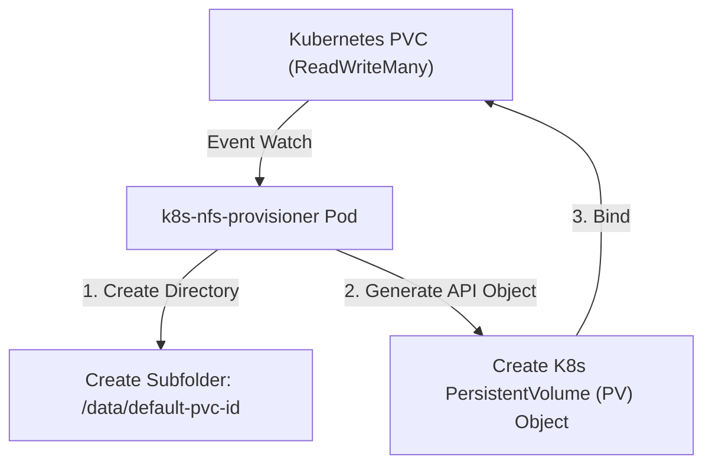

- **Deep Technical Details**:
  - **StorageClass Controller Pattern**: Monitors the Kubernetes API server for PVC events specifying `storageClassName: nfs-client`.
  - **Automated Directory Provisioning**: Automatically creates subdirectories on `10.140.0.5:/data` and provisions corresponding `PersistentVolume` (PV) objects.
- **What Breaks Without It**: Administrators must manually SSH into NFS servers to create subdirectories and write complex PV YAML manifests for every single pod.
