# 🚀 Complete High-Availability Ceph + NFS-Ganesha Architecture & Deployment Guide

This document provides a comprehensive technical reference for the **High-Availability (HA) Ceph + NFS-Ganesha + Pacemaker/Corosync Storage Cluster** integrated with a **5-Node Kubernetes Cluster** on Google Cloud Platform (GCP).

---

## 🏗️ Unified 15-Tool ASCII Architecture Diagram

```text
==============================================================================================================
                                ☸️ KUBERNETES COMPUTE LAYER (Pods & Workloads)
==============================================================================================================
[ K8s Control Plane Nodes ]                                                [ K8s Worker Nodes ]
  • nfs-common (Linux Kernel Driver)                                         • nfs-common (Linux Kernel Driver)
  • k8s-nfs-provisioner (StorageClass)                                      • Pods (Nextcloud / Spring Apps)
         │                                                                          │
         └────────────────────────────────────┬─────────────────────────────────────┘
                                              │ (NFSv4 Write Requests to 10.140.0.5:2049)
                                              ▼
==============================================================================================================
                     ⚡ HIGH-AVAILABILITY & NFS GATEWAY LAYER (Pacemaker + Ganesha)
==============================================================================================================
                         [ ⚡ Floating Virtual IP: 10.140.0.5 (Pacemaker Managed) ]
                                              │
                 ┌────────────────────────────┴────────────────────────────┐
                 ▼                                                         ▼
    ┌─────────────────────────┐                               ┌─────────────────────────┐
    │ 🟢 Server 1 (haproxy-1) │                               │ 🟡 Server 2 (haproxy-2) │
    │    [ ACTIVE GATEWAY ]   │                               │    [ STANDBY GATEWAY ]  │
    ├─────────────────────────┤                               ├─────────────────────────┤
    │ 🌐 nfs-ganesha          │                               │ 🌐 nfs-ganesha          │
    │ 🔌 nfs-ganesha-ceph     │                               │ 🔌 nfs-ganesha-ceph     │
    │ ⚡ pacemaker & pcsd     │ <══ UDP 5404/5405 Heartbeats ═>│ ⚡ pacemaker & pcsd     │
    │ 💓 corosync             │   (Totem Token Protocol)      │ 💓 corosync             │
    │ 📜 resource-agents-extra│                               │ 📜 resource-agents-extra│
    └────────────┬────────────┘                               └────────────┬────────────┘
                 │                                                         │
=================│=========================================================│==================================
                 ▼                                                         ▼
==============================================================================================================
                         💾 DISTRIBUTED STORAGE LAYER (Ceph Quincy + BlueStore)
==============================================================================================================
┌──────────────────────────────┐ ┌──────────────────────────────┐ ┌──────────────────────────────┐
│ [ Server 1: haproxy-1 ]      │ │ [ Server 2: haproxy-2 ]      │ │ [ Server 3: haproxy-3 ]      │
├──────────────────────────────┤ ├──────────────────────────────┤ ├──────────────────────────────┤
│ ⏱️ chrony (NTP Time Sync)    │ │ ⏱️ chrony (NTP Time Sync)    │ │ ⏱️ chrony (NTP Time Sync)    │
│ 🔓 ufw (Ports 2049,6789,2224)│ │ 🔓 ufw (Ports 2049,6789,2224)│ │ 🔓 ufw (Ports 2049,6789,2224)│
│ 🛠️ curl, wget, net-tools    │ │ 🛠️ curl, wget, net-tools    │ │ 🛠️ curl, wget, net-tools    │
├──────────────────────────────┤ ├──────────────────────────────┤ ├──────────────────────────────┤
│ 🐳 docker.io Containers:     │ │ 🐳 docker.io Containers:     │ │ 🐳 docker.io Containers:     │
│   • ceph-mon (Cluster Mon)   │ │   • ceph-mon (Cluster Mon)   │ │   • ceph-mon (Cluster Mon)   │
│   • ceph-mgr (Manager)       │ │   • ceph-mgr (Manager)       │ │   • ceph-mds (Metadata)      │
│   • ceph-osd (Storage)       │ │   • ceph-osd (Storage)       │ │   • ceph-osd (Storage)       │
├──────────────────────────────┤ ├──────────────────────────────┤ ├──────────────────────────────┤
│ 🧰 cephadm & ceph-common     │ │ 🧰 cephadm & ceph-common     │ │ 🧰 cephadm & ceph-common     │
│   (libcephfs.so C Library)   │ │   (libcephfs.so C Library)   │ │   (libcephfs.so C Library)   │
├──────────────────────────────┤ ├──────────────────────────────┤ ├──────────────────────────────┤
│ 💾 lvm2 -> Disk /dev/sdb     │ │ 💾 lvm2 -> Disk /dev/sdb     │ │ 💾 lvm2 -> Disk /dev/sdb     │
│   (50GB Ceph OSD Storage)    │ │   (50GB Ceph OSD Storage)    │ │   (50GB Ceph OSD Storage)    │
└──────────────┬───────────────┘ └──────────────┬───────────────┘ └──────────────┬───────────────┘
               │                                │                               │
               └────────────────────────────────┴───────────────────────────────┘
                                                ▼
                             [ 🔒 Unified 3x Replicated CephFS Storage Pool ]
==============================================================================================================
```

---

## 🛠️ Complete 15-Tool Inventory & Layer Placements

| Category | Tool / Package Name | Layer Placement | Technical Purpose & Function |
| :--- | :--- | :--- | :--- |
| **K8s Integration** | **`nfs-common`** | K8s Master & Worker Nodes | Linux kernel drivers (`mount.nfs4`, `rpcbind`) allowing nodes to mount NFS. |
| | **`k8s-nfs-provisioner`** | K8s Control Plane | Dynamic StorageClass controller (`nfs-client`) automating PVC subdirectory creation. |
| **HA & Failover** | **`pacemaker`** | Storage Tier (`haproxy-1..3`) | Cluster resource manager governing Virtual IP (`10.140.0.5`) failover. |
| | **`corosync`** | Storage Tier (`haproxy-1..3`) | Totem single-ring messaging engine running UDP 5404/5405 heartbeat pings. |
| | **`pcs` & `pcsd`** | Storage Tier (`haproxy-1..3`) | Management CLI and daemon (Port 2224) for cluster administration. |
| | **`resource-agents-extra`**| Storage Tier (`haproxy-1..3`) | OCF script library (`IPaddr2`) executing `ip addr add` & Gratuitous ARPs. |
| **NFS Gateway** | **`nfs-ganesha`** | Gateway Tier (`haproxy-1..3`) | User-space multi-threaded NFSv4 server daemon listening on TCP 2049. |
| | **`nfs-ganesha-ceph`** | Gateway Tier (`haproxy-1..3`) | FSAL plugin bridge translating NFS calls directly to CephFS. |
| **Storage Engine** | **`cephadm`** | Storage Tier (`haproxy-1..3`) | Master Ceph orchestrator managing container daemons and cluster topology. |
| | **`ceph-common`** | Storage Tier (`haproxy-1..3`) | `ceph` CLI tool and native `libcephfs.so` user-space C libraries. |
| | **`docker.io`** | Storage Tier (`haproxy-1..3`) | Container runtime running isolated Ceph daemons (`MON`, `MGR`, `OSD`, `MDS`). |
| | **`lvm2`** | Storage Tier (`haproxy-1..3`) | Formats `/dev/sdb` disks into raw BlueStore volume groups for OSD storage. |
| **Groundwork** | **`chrony`** | Infrastructure Base | NTP time sync daemon maintaining sub-millisecond clock alignment across nodes. |
| | **`ufw`** | Infrastructure Base | Linux firewall (configured disabled by default for unblocked cluster traffic). |
| | **`curl, wget, net-tools`**| Infrastructure Base | Package fetching, key verification, and socket debugging (`netstat`, `ifconfig`). |

---

## ⚡ High-Availability Failover Sequence

When `haproxy-1` crashes or loses power:

1. **`corosync`** detects missed token rotations on UDP 5404/5405 within **1000ms**.
2. **`pacemaker`** re-evaluates cluster membership and assigns Virtual IP `10.140.0.5` to `haproxy-2`.
3. **`resource-agents-extra`** (`IPaddr2`) executes `ip addr add 10.140.0.5/32 dev ens4` on `haproxy-2` and fires a **Gratuitous ARP (`arping -U 10.140.0.5`)** to update the GCP VPC router.
4. **`nfs-common`** on Kubernetes worker nodes automatically retries the TCP connection.
5. **`nfs-ganesha`** on `haproxy-2` handles the request, accessing identical mirrored data in **CephFS**.

---

## ☸️ Kubernetes Usage Guide

### Option 1: Dynamic PVC Approach (Recommended)

```yaml
apiVersion: v1
kind: PersistentVolumeClaim
metadata:
  name: app-storage-pvc
spec:
  accessModes:
    - ReadWriteMany
  storageClassName: nfs-client
  resources:
    requests:
      storage: 10Gi
```

### Option 2: Direct Inline NFS Mount (Legacy / Spring Apps)

```yaml
apiVersion: apps/v1
kind: Deployment
metadata:
  name: spring-register-app
spec:
  replicas: 2
  selector:
    matchLabels:
      app: spring-register
  template:
    metadata:
      labels:
        app: spring-register
    spec:
      containers:
        - name: register-cont
          image: xeng/spring-register:7
          ports:
            - containerPort: 8080
          volumeMounts:
            - name: register-vol
              mountPath: /src/main/resources/images
      volumes:
        - name: register-vol
          nfs:
            server: 10.140.0.5    # 👈 Active HA Virtual IP
            path: /data           # 👈 Ceph NFS Export Path
```

---

## 🔬 Individual Deep-Dive Reference & Step-by-Step Diagram Explanations for Every Tool

---

### 1. `corosync`
High-frequency cluster messaging engine running on UDP ports 5404 & 5405.

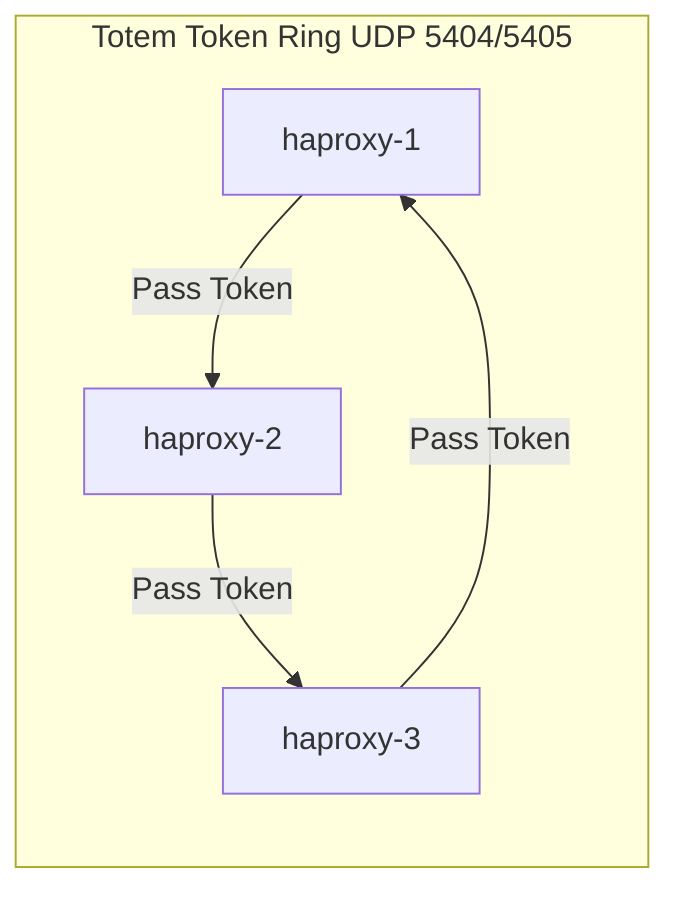

#### 📌 How to Read & Understand This Diagram:
- **Token Rotation**: `haproxy-1` holds a virtual Token packet and passes it to `haproxy-2` via UDP port 5404/5405.
- **Ring Order**: `haproxy-2` updates its node status and passes the Token to `haproxy-3`, which passes it back to `haproxy-1`.
- **Health Verification**: Every full token loop proves to all 3 nodes that all servers are alive and healthy.
- **Failure Detection**: If `haproxy-1` fails to pass the Token within 1000ms, `haproxy-2` and `haproxy-3` detect the break and form a majority quorum (2/3).

- **Deep Technical Details**:
  - Implements the **Totem Single-Ring Ordering Protocol**.
  - **Quorum Enforcement**: Calculates mathematical quorum ($N/2 + 1$). In a 3-node cluster, at least 2 nodes must be alive to form quorum.
  - **Split-Brain Protection**: Prevents partitioned nodes from touching storage simultaneously.
- **What Breaks Without It**: Dual-active split-brain write collisions that permanently corrupt CephFS.

---

### 2. `pacemaker`
High-availability cluster resource manager (The Brain).


#### 📌 How to Read & Understand This Diagram:
- **Event Trigger**: Corosync notifies Pacemaker that `haproxy-1` has crashed.
- **State Lookup**: Pacemaker updates `CIB` (Cluster Information Base XML database).
- **Transition Calculation**: `PEngine` calculates the optimal recovery path adhering to ordering & colocation constraints.
- **Execution**: `CRMd` daemon issues two OS commands: (1) Move Virtual IP `10.140.0.5` to `haproxy-2`, and (2) Start `nfs-ganesha`.

- **Deep Technical Details**:
  - **Constraints**: Enforces **Ordering** (`nfs_vip` starts BEFORE `nfs-ganesha`) and **Colocation** (`nfs-ganesha` runs on the SAME node holding `nfs_vip`).
  - **15-Second Health Checks**: Polls TCP port 2049 every 15 seconds to ensure NFS-Ganesha is healthy.
  - **STONITH Fencing**: Forcefully reboots unresponsive nodes.
- **What Breaks Without It**: When a server crashes, no automated process exists to migrate `10.140.0.5` or start NFS services on standby nodes.

---

### 3. `resource-agents-extra` (`IPaddr2`)
Standardized OCF script library executed by Pacemaker.

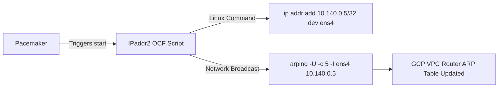

#### 📌 How to Read & Understand This Diagram:
- **Trigger**: Pacemaker orders `IPaddr2` to start the Virtual IP on `haproxy-2`.
- **Step 1 (IP Binding)**: `IPaddr2` executes OS command `ip addr add 10.140.0.5/32 dev ens4` to attach the IP to `haproxy-2`'s network card.
- **Step 2 (Network Broadcast)**: `IPaddr2` fires `arping -U -c 5 -I ens4 10.140.0.5` (Gratuitous ARP broadcast).
- **Step 3 (VPC Update)**: The GCP VPC router receives the ARP broadcast and immediately updates its internal routing table so all client traffic flows to `haproxy-2`.

- **Deep Technical Details**:
  - **OCF Specification**: Provides standard hooks (`start`, `stop`, `status`, `monitor`).
  - **Gratuitous ARP**: Unprompted ARP broadcast forcing network switches to update MAC address associations for `10.140.0.5`.
- **What Breaks Without It**: Pacemaker attempts failover, but the OS never physically binds `10.140.0.5` to the network interface or updates router ARP tables.

---

### 4. `nfs-ganesha`
User-space multi-threaded NFSv4 server daemon listening on TCP port 2049.

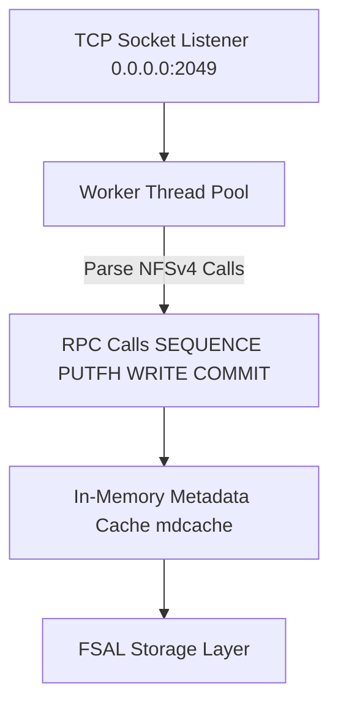

#### 📌 How to Read & Understand This Diagram:
- **Incoming Traffic**: TCP socket listener on port 2049 receives NFSv4 packets from Kubernetes pods.
- **Thread Allocation**: Assigns requests to dynamic `Worker Thread Pool` for multi-threaded processing.
- **RPC Parsing**: Parses NFSv4 RPC compound calls (`SEQUENCE`, `PUTFH`, `WRITE`, `COMMIT`).
- **RAM Lookup**: `MDCache` looks up inode attributes in memory to accelerate read/write performance.
- **Plugin Hand-off**: Cleaned file operations are handed to FSAL storage plugin.

- **Deep Technical Details**:
  - **User-Space Daemon**: Runs as `/usr/bin/ganesha.nfsd`, bypassing kernel single-thread bottlenecks.
  - **NFSv4 State Lock Recovery**: Integrates with Pacemaker via DBus to allow client pods to reclaim file locks during failover without `ESTALE` errors.
- **What Breaks Without It**: Pods hit single-threaded kernel locks under high load and suffer `Stale File Handle` (`ESTALE`) crashes during failovers.

---

### 5. `nfs-ganesha-ceph` (FSAL_CEPH)
FSAL plugin bridge (`libganesha_fsal_ceph.so`) translating NFS requests directly to CephFS.

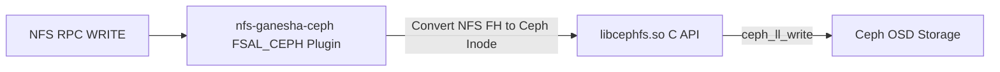

#### 📌 How to Read & Understand This Diagram:
- **NFS Input**: Receives NFS RPC `WRITE` requests from `nfs-ganesha`.
- **Inode Translation**: `FSAL_CEPH` converts NFS File Handles into CephFS Inode identifiers (`vinode_t`).
- **Direct Memory API Call**: Invokes user-space C function `ceph_ll_write()` in `libcephfs.so`.
- **Direct Ceph I/O**: Data streams directly into Ceph OSD storage without writing any temporary files to local host disk.

- **Deep Technical Details**:
  - **RAM-to-Ceph Streaming**: Direct C API streaming bypasses local host filesystem.
  - **Lock & Permission Mapping**: Maps NFS locks to Ceph MDS inode locks and preserves Linux `uid`/`gid` permissions.
- **What Breaks Without It**: `nfs-ganesha` cannot communicate with Ceph, forcing storage to write to un-replicated local host disks.

---

### 6. `cephadm`
Official master Ceph cluster orchestrator.

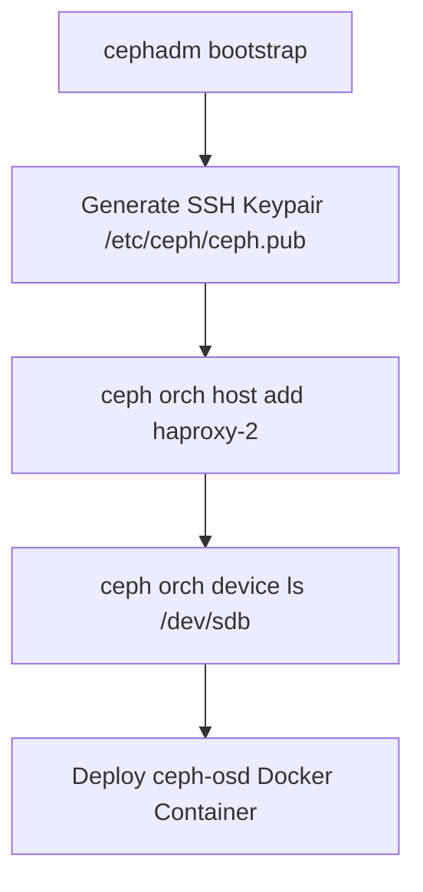

#### 📌 How to Read & Understand This Diagram:
- **Bootstrap**: `cephadm bootstrap` initializes the first monitor node and generates cluster SSH keys (`/etc/ceph/ceph.pub`).
- **Host Discovery**: `ceph orch host add` uses SSH to connect to `haproxy-2` and `haproxy-3`.
- **Device Scanning**: `ceph orch device ls` automatically detects unpartitioned raw block devices (`/dev/sdb`).
- **Container Deployment**: `cephadm` formats `/dev/sdb` via `lvm2` and launches `ceph-osd` Docker container daemons.

- **Deep Technical Details**:
  - **Automated Lifecycle**: Manages `ceph-mon`, `ceph-mgr`, `ceph-osd`, and `ceph-mds` Docker containers (`quay.io/ceph/ceph`).
  - **Zero-Downtime Upgrades**: Executes rolling container image updates node-by-node.
- **What Breaks Without It**: Cluster deployment requires over 150 manual, error-prone terminal commands for SSH keys, daemons, and systemd services.

---

### 7. `ceph-common`
Administrative CLI tools (`ceph`) and native user-space libraries (`libcephfs.so`).

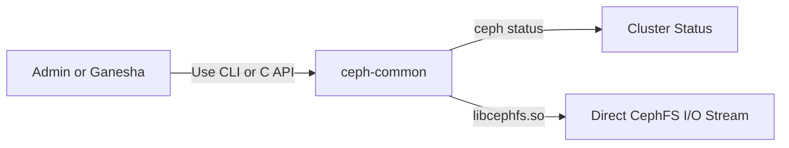

#### 📌 How to Read & Understand This Diagram:
- **Dual Functionality**: `ceph-common` serves both administrators (`ceph` CLI) and storage plugins (`libcephfs.so`).
- **Status Monitoring**: Administrator runs `ceph -s` to query cluster health, OSD status, and filesystem state.
- **C Library Streaming**: `libcephfs.so` provides native POSIX C function wrappers (`ceph_ll_lookup`, `ceph_ll_read`, `ceph_ll_write`) for `nfs-ganesha-ceph`.

- **Deep Technical Details**:
  - Provides low-level C functions and CLI administration tools.
- **What Breaks Without It**: `nfs-ganesha-ceph` fails to load due to missing `libcephfs.so` shared libraries, and administrative health monitoring commands fail.

---

### 8. `docker.io`
Linux container runtime engine.

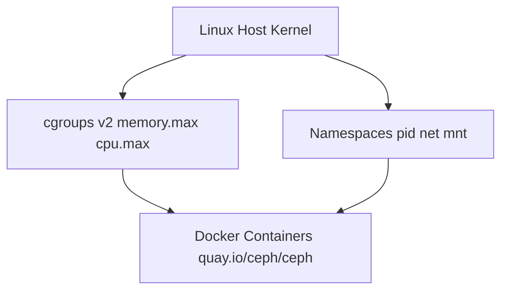

#### 📌 How to Read & Understand This Diagram:
- **Kernel Resource Controls**: `cgroups v2` restricts CPU and RAM consumption (`memory.max`, `cpu.max`) per Ceph container.
- **Namespace Isolation**: Linux `pid`, `net`, `ipc`, and `mnt` namespaces keep Ceph container libraries completely separate from host OS libraries.
- **Container Execution**: Runs official Ceph container images (`quay.io/ceph/ceph`) with automatic restart policies.

- **Deep Technical Details**:
  - Enforces container isolation and resource boundaries on all Ceph daemons.
- **What Breaks Without It**: Ceph daemons pollute host OS libraries, causing dependency conflicts and unmanaged process crashes.

---

### 9. `lvm2`
Logical Volume Manager.

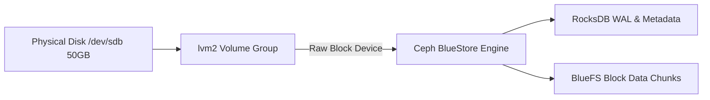

#### 📌 How to Read & Understand This Diagram:
- **Disk Format**: `lvm2` takes raw block disk `/dev/sdb` (50GB) and formats it into LVM Volume Groups.
- **Hand-off to BlueStore**: Raw volume group is handed directly to Ceph **BlueStore** engine.
- **Metadata vs Data**: BlueStore writes metadata and Write-Ahead Logs (WAL) to **RocksDB**, while data block chunks are allocated by **BlueFS**.

- **Deep Technical Details**:
  - Completely bypasses ext4/xfs filesystems to eliminate double-journaling performance penalties.
- **What Breaks Without It**: Ceph OSDs cannot format raw disks, falling back to slow filesystem journaling.

---

### 10. `chrony`
NTP time synchronization daemon.

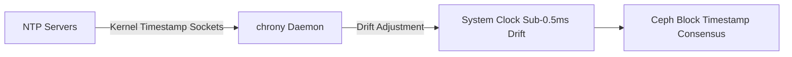

#### 📌 How to Read & Understand This Diagram:
- **NTP Ingestion**: `chrony` receives time packets from central NTP server pools via raw kernel timestamp sockets.
- **Drift Adjustment**: Continuously adjusts local Linux system clock drift to maintain **sub-0.5ms accuracy**.
- **Cluster Consensus**: Synchronized system clock feeds accurate timestamps into Ceph block consensus engine.

- **Deep Technical Details**:
  - Keeps drift under 0.5ms. If drift exceeds 0.05s, Ceph locks metadata mutations to prevent timestamp corruption.
- **What Breaks Without It**: Ceph locks metadata operations and enters `HEALTH_WARN (clock skew detected)`, blocking file writes.

---

### 11. `ufw`
Linux Uncomplicated Firewall.

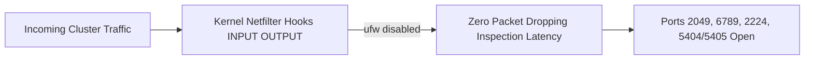

#### 📌 How to Read & Understand This Diagram:
- **Traffic Arrival**: Network packets arrive at Linux kernel Netfilter hooks (`INPUT`, `OUTPUT`).
- **Bypass Filter**: With `ufw` configured disabled, netfilter skips packet inspection and drop rules.
- **Port Delivery**: Cluster traffic reaches destination ports (2049, 6789, 2224, 5404/5405) instantly with zero inspection latency.

- **Deep Technical Details**:
  - Unblocked cluster communication prevents inter-node heartbeat drops.
- **What Breaks Without It**: Firewall rules drop Corosync heartbeat packets (5404/5405), causing false failover loops.

---

### 12. `curl, wget, net-tools`
System prerequisites and network debugging utilities.

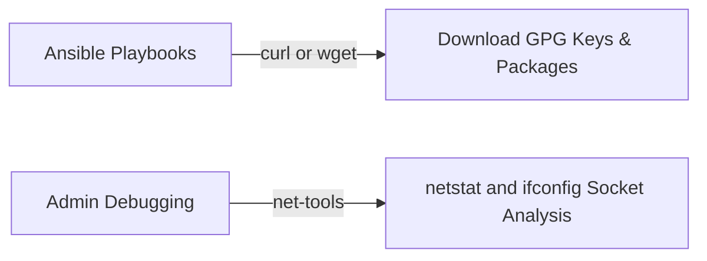

#### 📌 How to Read & Understand This Diagram:
- **Automated Provisioning**: Ansible playbooks execute `curl` or `wget` to fetch GPG signing keys and repository manifests.
- **System Diagnostics**: Administrator runs `net-tools` (`netstat -tulnp`, `ifconfig`) to verify active TCP/UDP socket listeners.

- **Deep Technical Details**:
  - Essential for fetching keys and analyzing socket states.
- **What Breaks Without It**: Playbooks fail to fetch GPG repository keys, and network socket inspection commands fail.

---

### 13. `nfs-common`
Linux kernel NFS client utilities (`mount.nfs4`, `rpcbind`).

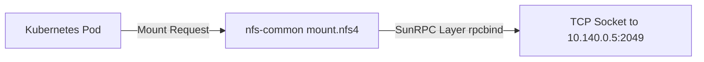

#### 📌 How to Read & Understand This Diagram:
- **Pod Mount Trigger**: Kubernetes pod requests an NFS volume mount on a worker node.
- **RPC Encapsulation**: `nfs-common` kernel module (`mount.nfs4` & `rpcbind`) packages the file request into SunRPC network frames.
- **Socket Transmission**: Streams SunRPC network frames over TCP socket to Virtual IP `10.140.0.5:2049`.

- **Deep Technical Details**:
  - Provides Linux kernel drivers (`nfs.ko`, `nfsv4.ko`) on Kubernetes nodes.
- **What Breaks Without It**: Kubernetes worker nodes fail to mount NFS volumes, throwing `mount: unknown filesystem type 'nfs'`.

---

### 14. `k8s-nfs-provisioner`
Kubernetes dynamic `nfs-client` StorageClass controller.


#### 📌 How to Read & Understand This Diagram:
- **Watch Event**: `k8s-nfs-provisioner` pod watches K8s API server for new PVCs specifying `storageClassName: nfs-client`.
- **Subdirectory Provisioning**: Provisioner pod automatically creates subdirectory `/data/default-pvc-id` on `10.140.0.5`.
- **PV Object Creation**: Provisioner pod creates a `PersistentVolume` (PV) object in Kubernetes API.
- **Binding**: Automatically binds the PV object to the user's PVC.

- **Deep Technical Details**:
  - Implements the Kubernetes StorageClass controller pattern for dynamic storage automation.
- **What Breaks Without It**: Administrators must manually SSH into NFS servers to create subdirectories and write complex PV YAML manifests for every single pod.
